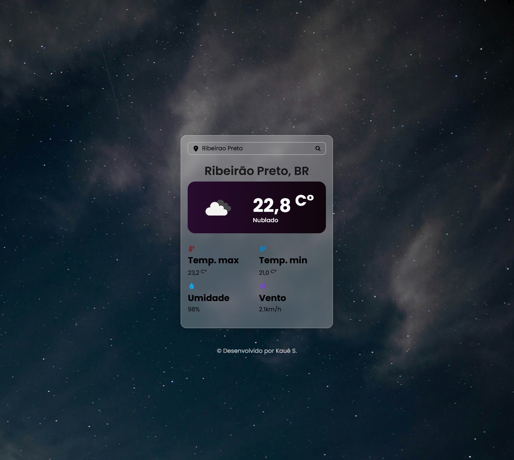

# 🌤️ Weather Forecast

Aplicação web que mostra o clima atual da cidade que o usuário pesquisar, consumindo dados da API do OpenWeather.

🔗 **Demo:** [soares-kaue.github.io/weather-forecast](https://soares-kaue.github.io/weather-forecast/)



## Funcionalidades

- Busca do clima por nome da cidade
- Exibe cidade e país, temperatura atual, descrição do tempo e ícone correspondente
- Mostra temperatura máxima e mínima, umidade e velocidade do vento
- Imagem de fundo que muda conforme o período do dia
- Tela de erro (404) quando a cidade não é encontrada
- Layout responsivo

## Tecnologias

- HTML5
- CSS3
- JavaScript (consumo de API com `fetch`)
- [API OpenWeather](https://openweathermap.org/api)

## Estrutura do projeto

```
weather-forecast/
├── index.html
└── src/
    ├── images/
    ├── javascript/
    │   └── script.js
    └── styles/
        └── styles.css
```

## Como rodar localmente

1. Clone o repositório:
```bash
   git clone https://github.com/soares-kaue/weather-forecast.git
```
2. Entre na pasta:
```bash
   cd weather-forecast
```
3. Abra o `index.html` no navegador.

> Para usar sua própria chave da API, crie uma conta gratuita no [OpenWeather](https://openweathermap.org/api) e substitua a chave em `src/javascript/script.js`.

## O que aprendi

- Consumir uma API REST com `fetch` e tratar a resposta em JSON
- Atualizar a interface dinamicamente manipulando o DOM
- Tratar erros de requisição (cidade não encontrada)
- Organizar um projeto em pastas separadas para HTML, CSS, JS e imagens
- Publicar um site com GitHub Pages

## Melhorias futuras

- [ ] Previsão para os próximos dias
- [ ] Busca pela localização atual do usuário
- [ ] Alternar entre °C e °F

## Autor

**Kauê Soares**
[LinkedIn](https://www.linkedin.com/in/iamkaue) · office.kauesoares@gmail.com
